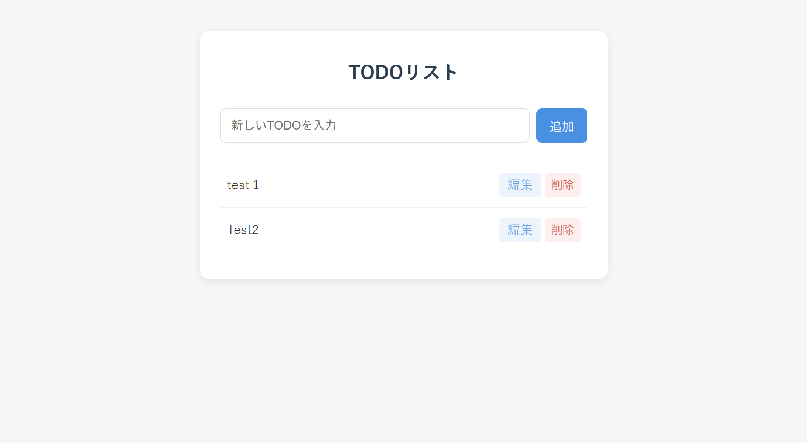

# TODOリストアプリ(PHP学習用)

PHPの基礎(フォーム処理・配列操作・ファイルI/O・関数化)を学ぶために、Laravelなどのフレームワークを使わず、素のPHPのみで作成したシンプルなTODOリストアプリです。

## スクリーンショット



## 主な機能

- TODOの追加
- TODOの一覧表示
- TODOの編集
- TODOの削除
- 入力内容のバリデーション(空白のみ入力・100文字超過をエラー表示)

## 使用技術

- PHP 8.4(素のPHPのみ、フレームワーク不使用)
- データの保存には、DBの代わりに`data.json`(JSONファイル)を使用

## ディレクトリ構成

```
todo-app/
├── index.php       # 一覧表示画面(メイン画面)
├── add.php         # TODO追加処理
├── edit.php        # TODO編集フォーム画面
├── update.php      # TODO更新処理
├── delete.php      # TODO削除処理
├── functions.php   # 共通処理(JSON読み書き、CRUD、バリデーション関数)
├── style.css       # スタイルシート
├── data.json       # TODOデータ保存先(自動生成、Git管理対象外)
└── images/         # README用の画像
```

## セットアップ方法

1. リポジトリをクローンする

```bash
git clone git@github.com:kazuyuki-a-dev/todo-app-php.git
cd todo-app-php
```

2. PHP内蔵サーバーを起動する

```bash
php -S localhost:8000
```

3. ブラウザで以下にアクセスする

```
http://localhost:8000
```

## 学習の背景

Laravelを学ぶ前段階として、フレームワークが裏側で何を担ってくれているかを理解する目的で、あえて素のPHPのみでCRUD・バリデーション・簡易的なMVC的構成を実装しました。

## 作成者

- 作成者: kazuyuki asari
- GitHub: https://github.com/kazuyuki-a-dev
